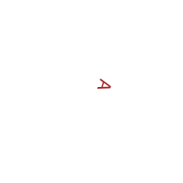
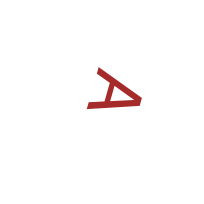
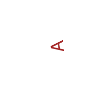
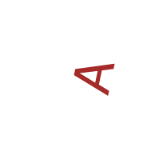

```{r setup, include=FALSE}
options(htmltools.dir.version = FALSE)
```

# Outline

- High Dimensional data
--

- Motivation and application
--

- Fundamentals and notation

---

class: inverse, center, middle

# Motivation

---

# High-dimensional data

- Data are high-dimensional
--

- Typically there are observations/cases and variables/features
--

- High dimensional refers to a large number of variables/features.
--

- How large? could be hundred, thousands or even infinite!

---

# World Bank Data

- Sourced from [World Bank](https://data.worldbank.org/indicator).
--

- Observations on 121 countries
--

- Variables are 65 indicators of economic and social well-being.
--

```{r,echo=FALSE,message=FALSE}

library(tidyverse)
library(knitr)
library(kableExtra)
wb<-read_csv('../data/WorldBankClean.csv')

kable(wb,format = 'html')%>%
  kable_styling(font_size = 9,bootstrap_options = c("striped","hover","condensed"))%>%
  scroll_box(height="280px")


```

---

# Indicators


```{r,echo=FALSE,message=FALSE,warning=FALSE}

wbm<-read_csv('../data/WorldBankMeta.csv')

kable(wbm,format = 'html')%>%
  kable_styling(font_size = 8,bootstrap_options = c("striped","hover","condensed"))%>%
  scroll_box(height="500px")


```


---

# Dimension Reduction

- These variables all measure a smaller number of factors such as:
--

  + Health and mortality
--

  + Economic Development
--

  + Country Size
--

  + ...
--

- Is there a way to reduce 65 indicators to 4-5 indicators?

---

# Image data

```{r,echo=F}

set.seed(1)
n<-1000 #Number of images
pixels=204 #Number of pixels (height and width)
rotation<-360*runif(n)-180 #Randomly generate an angle to rotate
scale<-5*runif(n)+1 #Randomly generate a scale

if(!(file.exists(paste0('../data/images/A',formatC(n,width = 4,flag='0'),'.png')))){
  for (i in 1:n){
  png(filename = paste0('../data/images/A',formatC(i,width = 4,flag='0'),'.png'),width = pixels,height=pixels)
  plot(0,0,axes=FALSE,xlab='',ylab='',col='white')
  text(0,0,'A',srt=rotation[i],cex=scale[i],col='brown')
  dev.off()
}


}

```


- A toy example
--

- Generate $`r n`$ images of  of the letter A each with $`r pixels` \times `r pixels`$ pixels.
--

- In each image the letter is a different size and rotated by a different angle.
--

- The color is always brown (encoded as RGB).
--

- The first 20 images are shown on the next slide.

---

# Images













---

# Image data

- One image is measured using three color channels for each pixel.
--

- This imples each image is summarised up by measurements for $3\times `r pixels`\times `r pixels`=`r sprintf('%d',3*pixels^2)`$ variables.
--

- In principle, a representation in two variables should be sufficient.

---

# Irish smart meter data

- Measure electricity usage at a half-hourly frequency over a two year period.
--

- There are data for 3639 households.
--

- Not interested in time series but in the distribution of electricity usage.
--

- Would like to identify anomalous households.

---

# Three households

```{r, echo=FALSE,message=F}

sm<-read_csv('../data/SmartMeter.csv')

ggplot(sm,aes(x=demand))+geom_density(fill='blue',alpha=0.2)+facet_wrap(~id,nrow = 3,scales = 'free_y')

```

---

# Densities

- Densities of a continuous variable are infinite dimensional objects.
--

- Does it make sense to represent this data in a small number of dimensions?
--

- If all of the densities are log-normal then they can be represented by two parameters.
--

- Dimension reduction makes sense for densities in general too.

---


# Why dimension reduction?

- Insight into structure of data
--

- Exploratory data analysis easier in low dimensions
--

  + Includes visualisation
--

- Avoid over-fitting in supervised learning (regression classification)
--

- Computational efficiency when searching in lower dimensional spaces

---

class: inverse, center, middle

# Fundamentals and Notation

---


# Basics

- Anything in **bold** and lower case is a vector.
--

- Anything in **bold** and UPPER case is a matrix.
--

- The data is made of $n$ observations and $p$ variables
--

- Observation $i$ is denoted $\bx_i\in\mathbb{R}^p$
--

- All data is stacked into an $n\times p$ matrix $\bX$
--

- Aim is to represent the data in a $m$ dimensions where $m<<p$
--

- These "output" vectors are denoted $\by_i\in\mathbb{R}^m$ for $i=1,\dots,n$

---

# Centering and Scaling

- Variables are measured in different units.
--

- Algorithms we cover not always invariant to the choice of units.
--

- Common to scale each variable by subtracting the mean and dividing by the standard deviation.

---

# Distance

- An important concept is the distance between two observations. The Euclidean distance between $\bx_i$ and $\bx_j$ given by

$$d_{i,j}=\sqrt{(\bx_i-\bx_j)'(\bx_i-\bx_j)}$$
--

- Alternatively $d_{i,j}$ could a different metric:
--

  + Manhattan distance 
  + Levenshtein distance
  + Hellinger distance

---

# Nearest Neighbours

- The nearest neighbour of a point $\bx_i$ is $\bx_j$ such that $d_{i,j}\leq d_{i,k}$ for all $k\neq j$
--

- The $k$ nearest neighbours can be similarly defined
--

- Often represent nearest neighbours using a graph where
--

  + Each node is an observation
  + Observations $i$ and $j$ are connected by edges if $i$ is a nearest neighbour of $j$ (or vice versa).
  
---

class: inverse, center, middle

#Questions?