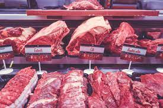
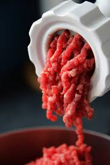
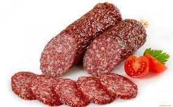

# Outline

- Neural Network
--

- Idea behind Autoencoder
--

- Discussion on software


```{r setup, include=FALSE}
options(htmltools.dir.version = FALSE)
knitr::opts_chunk$set(fig.align='center',echo = FALSE)
library(gifski)
library(ggrepel)
library(ggmap)
library(widgetframe)
```

---

class: center, middle, inverse

# Neural Networks

---

# Autoencoders are Neural Nets

- Most of you are probably familiar with neural networks.
--

- The autoencoder is a neural network with a clever trick for dimension reduction.
--

- Briefly cover neural nets for those without any background.

---

# The meat grinder

- Considers inputs $\bx$, a target $t$ and some function $f()$ such that $f(\bx)$ is close to the target $t$
--

- Consider a the analogy of a meat grinder used to make salami.





---

# Inside the grinder

```{r,message=FALSE}
library(neuralnet)
library(NeuralNetTools)
Salami=runif(100)
Pork=runif(100)
Veal=runif(100)
Spices=runif(100)
Salt=runif(100)
Garlic=runif(100)
grinder<-data.frame(Salami,Pork,Veal,Spices,Salt,Garlic)
my_nn<-neuralnet(Salami~Pork+Veal+Spices+Salt+Garlic,data = grinder,hidden=c(7,6),act.fct = "logistic",linear.output = FALSE)

#plot(my_nn,intercept = FALSE, information = FALSE,show.weights = FALSE,col.out = "#0072B2",col.hidden = "#D55E00", col.entry="#CC79A7",rep = 'best')

plotnet(my_nn,bias=FALSE,node_labs=FALSE,nid=FALSE)

```

---

# Details

- What happens at each node?
- First a linear combination is taken of all inputs to a node
  + Made up of weights and biases (intercepts) that need to be estimated.
- The linear combination is passed through a non linear function
  + Sigmoid function
  + RELU

---

# Training a neural network

- Consider a loss function that compares output to target
  + Mean square error
  + 0-1 loss
  + ...
--

- Find values of weights and biases that minimise the loss function over a training sample.

---

# How to do this?

- Many computational tricks for finding optimal weights
  + Automatic differentiation
  + (Stochastic) Gradient Descent
  + Use of GPUs
--

- Only a different course could do this justice.

---

# Trained Neural Net

```{r}
plotnet(my_nn,bias=FALSE,node_labs=FALSE,nid=TRUE)

```


---

class:inverse, middle, center

# Auto-encoders

---

# Stretching the analogy

- Consider the aim is not to make salami but dimension reduction.
--

- The idea is to break ingredients down into protons, electrons and neutrons.
--

- A neural network can be constructed for this problem.
--

- The trick is to use all variables as both input and output.

---

# An autoencoder

```{r}
ae<-neuralnet(Pork+Veal+Spices+Salt+Garlic~Pork+Veal+Spices+Salt+Garlic,data = grinder,hidden=c(7,3,6),act.fct = "logistic",linear.output = FALSE)

#plot(ae,intercept = FALSE, information = FALSE,show.weights = FALSE,col.out = "#0072B2",col.hidden = "#D55E00", col.entry="#CC79A7",rep = 'best',dimension=15)

plotnet(ae,bias=FALSE,node_labs=FALSE,nid=FALSE)

```

---

# The key idea

- There is a "skinny" middle layer containing fewer nodes than input (and output) variables.
--

- Everything up to this skinny part is called "the encoder"
--
  
  + Think of this as breaking down ingredients into protons, neutrons and electrons.
--

- Everything past this skinny part is the "decoder"
--

  + Think of this as reconstructing the ingredients.

---

# And that's it!

- An autoencoder is simply a neural network that
--

  + Has the same input and output
  + Get's "skinny" in the middle
--

- The advantages and disadvantages are the usual advantages and disadvantages of neural networks.

---

# Software

- Can be implemented using the `dimRed` package.
--

- However this merely wraps around tensorflow
--

  + Need to have reticulate and Python properly configured
--

  + Can be a bit time consuming and tricky.

---

# Advantages

- Very flexible and non-linear
--

- Can borrow ideas from neural network literature
--

  + Using convolutional layers for images
  + Using recurrent layers for time series
--

- Plenty of software and efficient packages

---

# Disadvantages

- Lots of tuning
  + How many layers?
  + Which activation function?
--

- Lots of parameters
  + Sparsity
--

- Lots of training data often needed

---

class: inverse, middle, center

# Questions?


---

