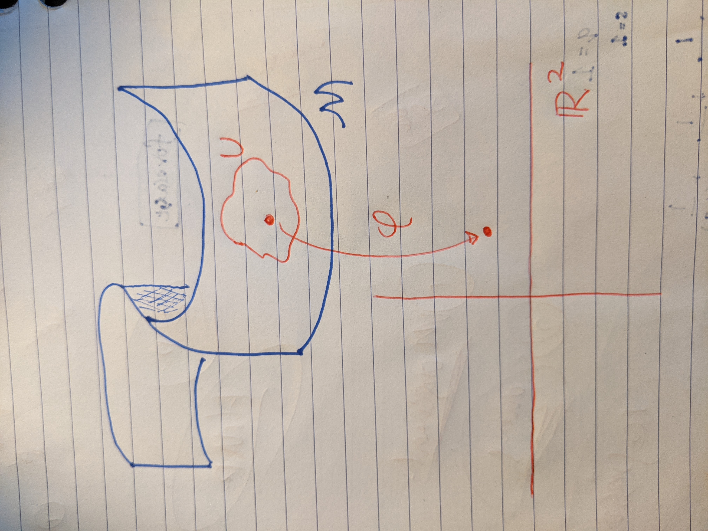
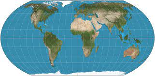
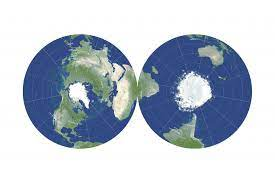
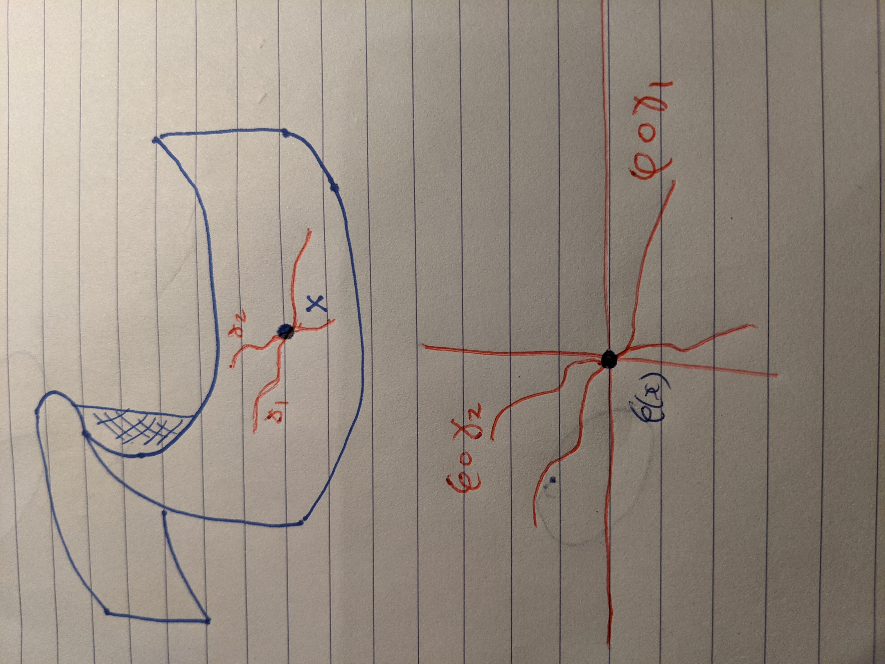
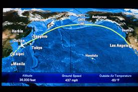

#Outline

- Topology
--

  + Neighbourhoods
--

- Geometry
--

  + Riemannian
  + Tangent spaces
--

- Throughout try not to lose track of manifold learning.

```{r setup, include=FALSE,message=FALSE}
options(htmltools.dir.version = FALSE)
knitr::opts_chunk$set(fig.align='center')

library(gifski)
library(knitr)
library(dimRed)
library(rgl)

```

---

class: center, middle, inverse

# Manifolds

---

# Sphere

```{r, eval=TRUE,out.height=500,out.width=400,echo=FALSE}


```

---
# S-Curve

```{r, webgl=TRUE,cache=TRUE, echo=FALSE,fig.align='center',messages=FALSE,warning=FALSE}

knit_hooks$set(webgl = hook_webgl)

invisible(open3d())

s3d<-loadDataSet("3D S Curve")
plot(s3d,type="3varsrgl")
rglwidget()
close3d()

```

---

# Swiss Roll

```{r, webgl=TRUE,eval=TRUE, cache=TRUE, echo=FALSE,fig.align='center',messages=FALSE,warning=FALSE}

invisible(open3d())

s3d<-loadDataSet("Swiss Roll")
plot(s3d,type="3varsrgl")
rglwidget()
close3d()


```

---
# Helix

```{r, webgl=TRUE,cache=TRUE, echo=FALSE,fig.align='center',messages=FALSE,warning=FALSE}

knit_hooks$set(webgl = hook_webgl)

invisible(open3d())

s3d<-loadDataSet("Helix")
plot(s3d,type="3varsrgl")
rglwidget()
close3d()

```

---

# Intuition

- Some object embedded in an *ambient* higher dimensional space.
--

- These examples are 1 or 2 dimensional manifolds, the ambient space is $\mathbb{R}^3$.
--

- By the *Whitney Embedding Theorem* a manifold of dimension $m$ can be embedded in $\bbR^{2m}$.
--

- In manifold learning the ambient space is typically very high-dimensional.


---

# Formal definition

- A manifold is a topological space that is locally homeomorphic to Euclidean space.
--

  + What do we mean by topological space?
  + What do we mean by local?
  + What do we mean by homeomorphic?

---

# Topological space

A set $X$ where each point $x\in X$ has a collection of sets $\bN(x)$ called neighborhoods which satisfy some axioms

---

# Axiom 1

- Each point belongs to every one of its neighbourhoods 
--

  + If $N\in\bN(x)$ then 
--
$x\in N$.
--

```{r,echo=F,out.height=450}

plot(0,0,cex=40,axes=FALSE,xlab='',ylab='',xlim=c(-1,1),ylim=c(-1,1))
text(0.55,0.55,'N(x)',cex=2)
points(0.2,0.2,pch=16,col='white')
text(0.24,0.22,'x',col='white',cex=2)
```

---

# Axiom 1

- Each point belongs to every one of its neighbourhoods 
  + If $N\in\bN(x)$ then 
$x\in N$.
```{r,echo=F,out.height=450}
plot(0,0,cex=40,axes=FALSE,xlab='',ylab='',xlim=c(-1,1),ylim=c(-1,1))
text(0.55,0.55,'N(x)',cex=2)
points(0.2,0.2,pch=16)
text(0.24,0.22,'x',cex=2)
```

---


# Axiom 2

- Every superset of a neighbourhood of $x$ is again a neighbourhood of $x$ 
--

  + If $N_1\in\bN(x)$ 
--
and $N_2\supset N_1$ 
--
then $N_2\in\bN(x)$.
--

```{r,echo=F,out.height=450,message=FALSE}
library(latex2exp)
plot(0,0,cex=40,axes=FALSE,xlab='',ylab='',xlim=c(-1,1),ylim=c(-1,1),col='white')
text(0.55,0.73,TeX('$N_2(x)\\supset N_1(x)$'),col='white',cex=2)
points(0.15,0.2,cex=15)
text(0.34,-0.17,TeX('$N_1(x)$'),cex=2)
points(0.2,0.2,pch=16)
text(0.25,0.23,'x',cex=2)

```


---

# Axiom 2

- Every superset of a neighbourhood of $x$ is again a neighbourhood of $x$ 
  + If $N_1\in\bN(x)$ and $N_2\supset N_1$ then $N_2\in\bN(x)$.
```{r,echo=F,out.height=450,message=FALSE}
library(latex2exp)
plot(0,0,cex=40,axes=FALSE,xlab='',ylab='',xlim=c(-1,1),ylim=c(-1,1),col='blue')
text(0.55,0.73,TeX('$N_2(x)\\supset N_1(x)$'),col='blue',cex=2)
points(0.15,0.2,cex=15)
text(0.34,-0.17,TeX('$N_1(x)$'),cex=2)
points(0.2,0.2,pch=16)
text(0.25,0.23,'x',cex=2)

```
---

# Axiom 3

- The intersection of two neighbourhoods of $x$ is a neighbourhood of $x$ 
--

  + If $N_1,N_2\in\bN(x)$ 
--
then $N_1\cap N_2\in\bN(x)$.
--

```{r,echo=F,out.height=450}

plot(0.2,0,cex=30,axes=FALSE,xlab='',ylab='',xlim=c(-1,1),ylim=c(-1,1),col='blue')
text(0.57,0.57,TeX('$N_2(x)$'),col='blue',cex=2)
points(-0.2,0,cex=30)
text(-0.57,-0.57,TeX('$N_1(x)$'),cex=2)
points(0.05,0.1,pch=16)
text(0.08,0.13,'x',cex=2)

```

---

# Axiom 4

- Every neighbourhood of $x$ contains a subset s.t. every point in that subset has the original set as its neighbourhood.
--

  + If $N\in \bN(x)$ 
--
there exists $Z\subset N$ 
--
such that for all $z\in Z$ 
--
it holds that $N\in\bN(z)$.
--

```{r,echo=F,out.height=400}

plot(0,0,cex=35,axes=FALSE,xlab='',ylab='',xlim=c(-1,1),ylim=c(-1,0.8),col='blue')
text(0.5,0.5,'N(x)',col='blue',cex=2)
points(0.15,0.2,cex=15,col='white')
text(0.25,-0.1,TeX('$Z\\subset N(x)$'),cex=2,col='white')
points(0.2,0.2,pch=16,col='white')
text(0.23,0.23,'z',cex=2,col='white')
points(-0.26,-0.26,pch=16,col='blue')
text(-0.23,-0.23,'x',col='blue',cex=2)

```

---

# Axiom 4

- Every neighbourhood of $x$ contains a subset s.t. every point in that subset has the original set as its neighbourhood.
  + If $N\in \bN(x)$ there exists $Z\subset N$ such that for all $z\in Z$ it holds that $N\in\bN(z)$.
```{r,echo=F,out.height=400}

plot(0,0,cex=35,axes=FALSE,xlab='',ylab='',xlim=c(-1,1),ylim=c(-1,0.8),col='blue')
text(0.5,0.5,'N(x)',col='blue',cex=2)
points(0.15,0.2,cex=15)
text(0.25,-0.1,TeX('$Z\\subset N(x)$'),cex=2)
points(0.2,0.2,pch=16)
text(0.23,0.23,'z',cex=2)
points(-0.26,-0.26,pch=16,col='blue')
text(-0.23,-0.23,'x',col='blue',cex=2)

```

---

# Neighbours

- Emphasise here that topology is all about neighbours.
--

- Similarly manifold learning techniques often start by finding nearest neighbours.
--

- Later on we will discuss how the fidelity of a manifold learning algorithm can be understood in terms of how well it preserves neighbourhood structure.

---

# Homeomorphic

- A homeomorphism is a mapping $f:X\rightarrow Y$ between two topological spaces that
--

  + Is a bijection
  + It is continuous
  + It has a continuous inverse
--

- A homeomorphism preserves neighbourhood structure

---

# Local and Euclidean

- Let $x$ be a point on a manifold $\calM$ and let $U$ be a neighbourhood of $x$.
--

- Locally homeomorphic to Euclidean space, means that there is a mapping (called a chart) $\phi:U\rightarrow \bbR^m$
--

- A collection of charts covering the whole manifold is called an atlas.

---

# Chart

```{r, eval=TRUE,echo=FALSE, out.height=550}



```


---

# Terminology

- Consider earth as a sphere.
--

- Taking a patch of the earth (e.g. Australia) and mapping each point onto a flat 2-d page is a *chart*.
--

- Doing the same with the rest of the world, in a way that covers the whole world gives an *atlas*.
--

- Cannot map the whole earth with one chart without "cutting". Need at least 2 charts.

---

# Earth

```{r, eval=TRUE,echo=FALSE}



```
--

```{r, eval=TRUE,echo=FALSE}



```

---

# Manifold learning

- Is manifold learning about finding a chart?
--

- Reading between the lines of the literature can lead to this conclusion but they are not the same.
--

- However, many toy examples (S-curve, Swiss Roll) can be covered by a single chart.
--

- Manifold learning is also motivated by preserving distance.

---

class: center, inverse, middle

#Geometry

---

# Riemannian manifold

- So far we have not discussed the geometric properties of a manifold.
--

- To do this we must add some more structure to the manifold.
--

- In our context, this extra structure will be the Riemannian.
--

- Manifolds with this structure are called Riemannian manifolds.

---

# Riemannian

- The Riemannian metric of a manifold $M$ defined at the point $x$ is an inner product $g_x:T_xM\times T_xM\rightarrow\bbR$ defined on the tangent space of $M$.
--

- What is an inner product?
--

- What is a tangent space?

---

# Inner product

- The inner product you are probably familiar with is the inner product in Euclidean space.
--

- For vectors $\bv$ and $\bw$ the inner product is $\bv'\bw$
--

- The inner product tells us something about the angle between two vectors. 
--

- The inner product of $\bv$ and itself tells us something about the length of the vector. 
--

- Inner products are associated with geometric properties.

---

# Tangent space

- Suppose $\gamma(t):(-1,1)\rightarrow M$ and $\gamma(0)=x$. 
--

- Also let $\varphi$ be a chart around $x$. 
--

- The equivalence class of curves $\gamma$ for which
--

$$\frac{d}{dt}\left[\left.(\varphi\circ\gamma)(t)\right]\right|_{t=0}$$
--

evaluates to the same value are known as tangent vectors $\gamma'$.
--

- Together these make up the tangent space.

---

# Picture

```{r, eval=TRUE,echo=FALSE, out.height=550}



```

---
# Informally

- Informally imagine you are moving along the manifold.
--

- Suppose you characterise the direction of movement and speed of movement at the point $x$ by a vector.
--

- The collection of all such vectors is a tangent space.

---


# Geodesic distance

- A useful application of these ideas is to find the geodesic.
--

- Let $\gamma:(a,b)\rightarrow M$ be a path along the manifold with $\gamma(a)=x_1$ and $\gamma(b)=x_2$. The geodesic distance from $x_1$ to $x_2$ is given by
--

$$\delta(x_1,x_2)=\underset{\gamma(t)}{\inf}\int_{a}^{b} g_{\gamma(t)}(\gamma'(t),\gamma'(t))dt$$
---

# Geodesics in real life


```{r, eval=TRUE,echo=FALSE, out.height=450}



```


---

# Isometries

A mapping $f:\calM\rightarrow\bbR^m$ is isometric if

$$d_\calM(x_1,x_2)=d(f(x_1),f(x_2))$$

where the distance on the RHS is Euclidean.
--

- This is not always possible.
--

- The *Nash embedding theorem* states that there is an isometry between an $m$ dimensional manifold and $\bbR^{m(3m+11)/2}$
--

- Against the spirit of dimension reduction.
---

# Summary

- In data science we are trying to uncover the manifold we do not compute charts and tangent spaces and geodesics using these formal definitions.
--

- Nonetheless these ideas are important to understand the logic behind manifold learning algorithms
--

- Geodesics, tangent spaces, isometries do arise in the manifold learning literature

---

class: center, middle, inverse

#Questions?