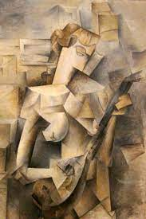

#Outline

- Local Geometry
--

  + Affine Combination of Neighbours
--

- Local Linear Embedding (LLE) algorithm
--

- Applications
--

- Initially proposed in Roweis, S. T., & Saul, L. K. (2000). "Nonlinear dimensionality reduction by locally linear embedding.", *Science*, **290**, 2323-2326.

```{r setup, include=FALSE,message=FALSE}
options(htmltools.dir.version = FALSE)
knitr::opts_chunk$set(fig.align='center',echo=FALSE,message = FALSE,out.height = 450)

library(gifski)
library(tidyverse)
library(knitr)
library(ggthemes)
library(dimRed)
library(rgl)
library(ggrepel)
library(microbenchmark)
knit_hooks$set(webgl = hook_webgl)

```

---

class: center, middle, inverse

# Local Geometry

---

#Idea

- A smooth manifold may be locally flat (at least approximately).
--

- Each point can be approximated by a weighted affine combination of its neighbours.
--

- These weights "capture" the local geometry around that point.
--

- Aim is for points in the output space to have the same local geometry (as measured by weights)

---

# An artist's view

```{r}

```

Girl with a Mandolin by Pablo Picasso

---

# A mathematician'view

- Each point $\bx_i$ is estimated as a linear combination of neighbours
--

$$\bx_i\approx\sum\limits_{j\in \mathcal{N}_i} w_{ij}\bx_j$$
--

where $\mathcal{N}_i$ is set of nearest neighbours of $\bx_i$
--

- Subject to constraint $\sum\limits_{j\in \mathcal{N}_i} w_{ij}=1$ 
--

- This is known as an **affine** combination.

---

#Closed form solution

- For each $i$, minimise

$$||\bx_i-\sum\limits_{j\in \mathcal{N}_i} w_{ij}\bx_j||_2^2$$

-  Letting $\bC$ be a matrix where $\bC_{jk}=||\bx_i-\bx_j||^2_2$ the solution is

$$\bw_j=\frac{\sum\limits_k \bC^{-1}_{jk}}{\sum\limits_{k}\sum\limits_{l}\bC^{-1}_{jk}}$$

---

# Singular $\bC$

- In some cases (e.g. $k>d$) the matrix $\bC$ is singular.
--

- This is handled by adding a small constant to the diagonal of $\bC$.
--

- This has the effect of penalising large weights.

---

# Example


```{r,warning=FALSE,out.height=600}
set.seed(6)

k<-3
x_i<-c(runif(1),runif(1))
eps<-matrix(rnorm(k*2),k,2)
x_j<-matrix(NA,k,2)
for (j in 1:k){
  x_j[j,]<-x_i+eps[j,]
}

df<-as_tibble(rbind(x_i,x_j))%>%add_column(Point=c('xi',rep('xj',k)))
colnames(df)[1:2]<-c('x1','x2')
C<-eps%*%t(eps)
trC<-(sum(diag(C)))
diag(C)<-diag(C)+((1E-8*trC)/k)
w<-solve(C,rep(1,k))
w<-w/sum(w)

df%>%add_column(Weight=c(NA,w),WeightSign=c(NA,as.character(w>0)))->df

df%>%ggplot(aes(x=x1,y=x2))+geom_point(aes(col=Point),size=5,show.legend=FALSE)+scale_color_colorblind()+coord_equal()
```

---

#Weights

```{r,out.height=600,warning=FALSE}
df%>%ggplot(aes(x=x1,y=x2))+geom_point(aes(col=Point,size=abs(Weight)),size=5,show.legend=FALSE)+scale_color_colorblind()+coord_equal()+geom_text_repel(aes(label=as.character(round(Weight,3))),show.legend=FALSE)

```
---

# Negative weights possible


```{r,warning=FALSE}
set.seed(7)

k<-3
x_i<-c(runif(1),runif(1))
eps<-matrix(rnorm(k*2),k,2)
x_j<-matrix(NA,k,2)
for (j in 1:k){
  x_j[j,]<-x_i+eps[j,]
}

df<-as_tibble(rbind(x_i,x_j))%>%add_column(Point=c('xi',rep('xj',k)))
colnames(df)[1:2]<-c('x1','x2')
C<-eps%*%t(eps)
trC<-(sum(diag(C)))
diag(C)<-diag(C)+((1E-8*trC)/k)
w<-solve(C,rep(1,k))
w<-w/sum(w)

df%>%add_column(Weight=c(NA,w),WeightSign=c(NA,as.character(w>0)))->df

df%>%ggplot(aes(x=x1,y=x2))+geom_point(aes(col=Point),size=5,show.legend=FALSE)+scale_color_colorblind()+coord_equal()+geom_text_repel(aes(label=as.character(round(Weight,3))),show.legend=FALSE)

```

---


# Why an affine combination?

- Local geometry should be invariant to
--

  + Rotation
  + Scaling
  + Translation
--

- Minimising $||(\bx_i+\bv)-\sum\limits_{j\in \mathcal{N}_i} w_{ij}(\bx_j+\bv)||_2^2$
--
 is the same as minimising $||\bx_i-\sum\limits_{j\in \mathcal{N}_i} w_{ij}\bx_j||_2^2$
--
 only if weights sum to one.

---

class: center, middle, inverse

# LLE Algorithm

---

#Three steps

- Find nearest neighbours
--
  
  + Can be KNN or $\epsilon$-ball
--

- Find all $w_{ij}$ and put into a matrix $\bW$
--

  + This matrix will be sparse
--

- Keeping weights fixed find output vectors $\by_i$ that reflect the local geometry as encoded by the weights 

---

# Step three

- Objective is to find $\by_1,\by_2,\dots,\by_n$ to minimise
--

$$\sum\limits_{i}||\by_i-\sum\limits_j w_{ij}\by_j||^2_2$$
--

- The same objective as before but with $\by_i$ in place of $\bx$.
--

- Rather than optimise with respect to weights $w_{ij}$, the weights are held fixed and optimisation is with respect to $\by_i$

---

# Solution

- To make this problem well-posed the following constraints are placed on the $\by_i$
--

 - Have zero mean
 - Have unit variance
 - Are uncorrelated
--

- The solution is given by finding the eigenvectors of $(\bI-\bW)'(\bI-\bW)$.
--

---

# Eigenvalue decomposition

- The eigenvector corresponding to the smallest eigenvalue simply maps every point on the manifold to the same value.
--

- This eigenvector is discarded.
--

- The eigenvectors corresponding to the next $d$ smallest eigenvalues are retained as the output coordinates.
--

- The sparsity of $\bW$, and the need to only find a subset of eigenvectors ensures LLE is computationally efficient.

---

class: center, middle, inverse

# Application

---

# S Curve

```{r,echo=T,eval=F}
dat <- loadDataSet("3D S Curve")
plot(dat,type='3varsrgl')

```

```{r,echo=F,webgl=TRUE}

dat <- loadDataSet("3D S Curve")
invisible(open3d())
plot(dat,type='3varsrgl')
rglwidget()
close3d()


```

---


# Isomap (K=20)

```{r,echo=T,cache=TRUE}
isoout <- embed(dat, "Isomap", knn = 20)
plot(isoout, type = "2vars")

```

---

# LLE (K=20)


```{r,echo=TRUE,message=FALSE,warning=FALSE,results=FALSE,cache=TRUE}
lleout <- embed(dat, "LLE", knn = 20)
plot(lleout, type = "2vars")
```

---

# LLE (K=30)


```{r,echo=TRUE,message=FALSE,warning=FALSE,results=FALSE,cache=TRUE}
lleout <- embed(dat, "LLE", knn = 30)
plot(lleout, type = "2vars")
```

---
# LLE (K=40)


```{r,echo=TRUE,message=FALSE,warning=FALSE,results=FALSE,cache=TRUE}
lleout <- embed(dat, "LLE", knn = 40)
plot(lleout, type = "2vars")
```


---

# Pros and Cons

- Advantages
  + Fast due to exploitation sparse eigenvalue algorithms
  + This can be implementation dependent
--

- Disadvantages
  + Only captures local geometry
  + Can be inaccurate on less smooth parts of the manifold
